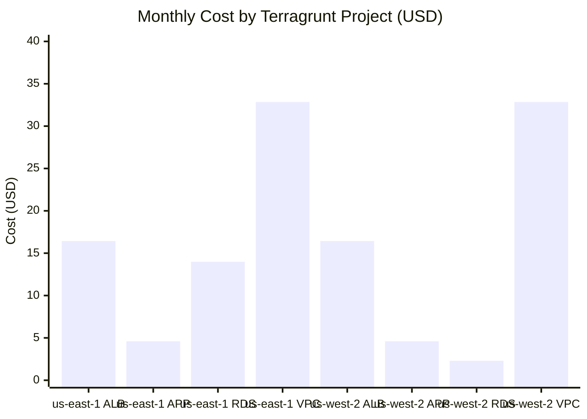
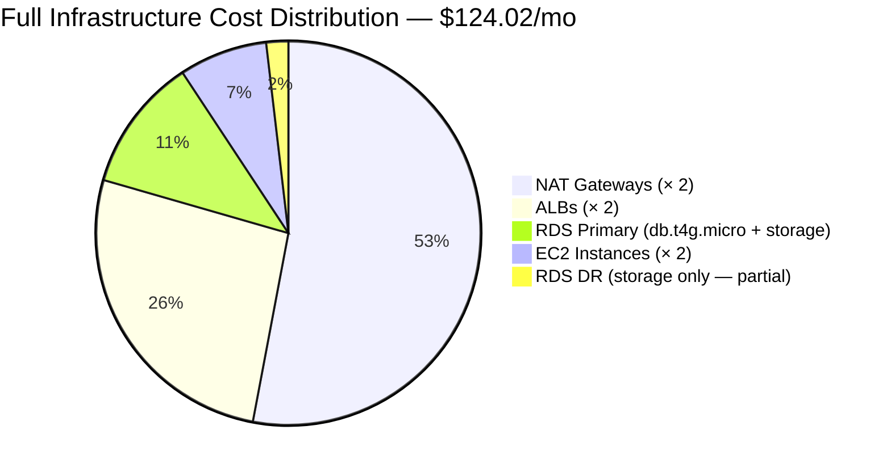
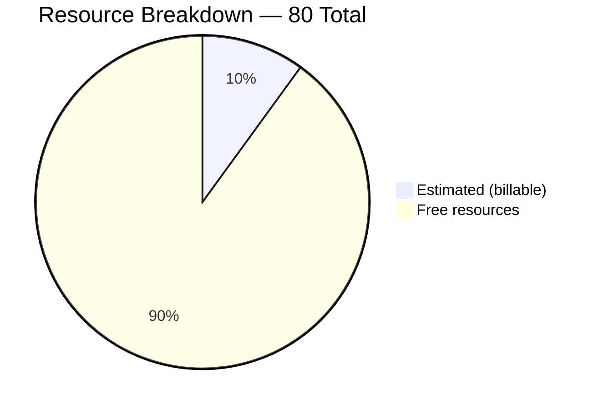

# 💰 FinNow — Infracost Breakdown Report

<div align="center">

[](https://www.infracost.io/)
[]()
[]()
[]()
[]()

<br/>

> Auto-generated cost breakdown via `infracost breakdown` across **8 Terragrunt root modules**  
> spanning two AWS regions — `us-east-1` (Primary) and `us-west-2` (Warm Standby DR).

</div>

---

## 📊 Cost Summary by Project


| Project | Module Path | Baseline Cost | Usage Cost | **Total** |
|---|---|---|---|---|
| `us-east-1-alb` | `us-east-1/alb` | $16.43 | — | **$16** |
| `us-east-1-app` | `us-east-1/app` | $4.60 | — | **$5** |
| `us-east-1-rds` | `us-east-1/rds` | $13.98 | — | **$14** |
| `us-east-1-vpc` | `us-east-1/vpc` | $32.85 | — | **$33** |
| `us-west-2-alb` | `us-west-2/alb` | $16.43 | — | **$16** |
| `us-west-2-app` | `us-west-2/app` | $4.60 | — | **$5** |
| `us-west-2-rds` | `us-west-2/rds` | $2.30 ⚠️ | — | **$2** |
| `us-west-2-vpc` | `us-west-2/vpc` | $32.85 | — | **$33** |
| | | | **OVERALL TOTAL** | **$124.02** |

> ⚠️ `us-west-2-rds`: `aws_db_instance` compute price reported as `not found` by Infracost (known pricing API gap for cross-region read replicas on `db.t4g.micro`). Storage cost of `$2.30` was captured. Actual instance cost mirrors `us-east-1` at ~`$11.68/mo`.

---

## 🔍 Resource-Level Breakdown

### 🏢 us-east-1 — Primary Region

#### Application Load Balancer — `$16.43/mo`

| Resource | Qty | Unit | Cost |
|---|---|---|---|
| `aws_lb.this` — ALB hours | 730 | hours | $16.43 |
| Load Balancer Capacity Units | usage-based | per LCU | $5.84/LCU |

#### EC2 Application Instance — `$4.60/mo`

| Resource | Qty | Unit | Cost |
|---|---|---|---|
| `aws_instance.app` — `t3.nano` Linux on-demand | 730 | hours | $3.80 |
| Root EBS volume (`gp2`) | 8 | GB | $0.80 |

#### RDS PostgreSQL Primary — `$13.98/mo`

| Resource | Qty | Unit | Cost |
|---|---|---|---|
| `aws_db_instance.this` — `db.t4g.micro` Single-AZ | 730 | hours | $11.68 |
| Storage `gp3` | 20 | GB | $2.30 |
| Additional backup storage | usage-based | per GB | $0.095/GB |

#### VPC + NAT Gateway — `$32.85/mo`

| Resource | Qty | Unit | Cost |
|---|---|---|---|
| `aws_nat_gateway.this[0]` — NAT hours | 730 | hours | $32.85 |
| Data processed | usage-based | per GB | $0.045/GB |

---

### 🛡️ us-west-2 — DR Region (Warm Standby)

#### Application Load Balancer — `$16.43/mo`

| Resource | Qty | Unit | Cost |
|---|---|---|---|
| `aws_lb.this` — ALB hours | 730 | hours | $16.43 |
| Load Balancer Capacity Units | usage-based | per LCU | $5.84/LCU |

#### EC2 Application Instance — `$4.60/mo`

| Resource | Qty | Unit | Cost |
|---|---|---|---|
| `aws_instance.app` — `t3.nano` Linux on-demand | 730 | hours | $3.80 |
| Root EBS volume (`gp2`) | 8 | GB | $0.80 |

#### RDS PostgreSQL Read Replica — `$2.30/mo` ⚠️

| Resource | Qty | Unit | Cost |
|---|---|---|---|
| `aws_db_instance.this` — `db.t4g.micro` Single-AZ | 730 | hours | `not found` ⚠️ |
| Storage `gp2` | 20 | GB | $2.30 |

#### VPC + NAT Gateway — `$32.85/mo`

| Resource | Qty | Unit | Cost |
|---|---|---|---|
| `aws_nat_gateway.this[0]` — NAT hours | 730 | hours | $32.85 |
| Data processed | usage-based | per GB | $0.045/GB |

---

## 🥧 Cost Distribution


---

## 📋 Resource Inventory


| Category | Count |
|---|---|
| Total cloud resources detected | **80** |
| Resources with estimated cost | **8** |
| Free resources (SGs, Route Tables, etc.) | **72** |

---

## ⚠️ Known Pricing Gaps

| Issue | Affected Resource | Impact | Notes |
|---|---|---|---|
| `aws_db_instance` price missing | `us-west-2/rds` — `db.t4g.micro` read replica | ~$11.68/mo untracked | Infracost pricing API gap for cross-region read replicas on Graviton. Actual cost mirrors primary instance. |
| Usage-based costs not estimated | NAT Gateway data, ALB LCUs, RDS backup | Variable | Requires `infracost-usage.yml` with traffic estimates to model accurately. |

---

## ▶️ Reproduce This Report
```bash
# From the repo root
infracost breakdown --path ~/finnow-drx-infrastructure/terragrunt

# With usage estimates (optional — improves accuracy of variable costs)
infracost breakdown \
  --path ~/finnow-drx-infrastructure/terragrunt \
  --usage-file infracost-usage.yml

# Export as JSON for CI/CD integration
infracost breakdown \
  --path ~/finnow-drx-infrastructure/terragrunt \
  --format json \
  --out-file infracost-output.json
```

---

<div align="center">

*Generated by [`infracost`](https://www.infracost.io/) · Part of the [FinNow Infrastructure](./README.md) project*

[](./README.md)

</div>
