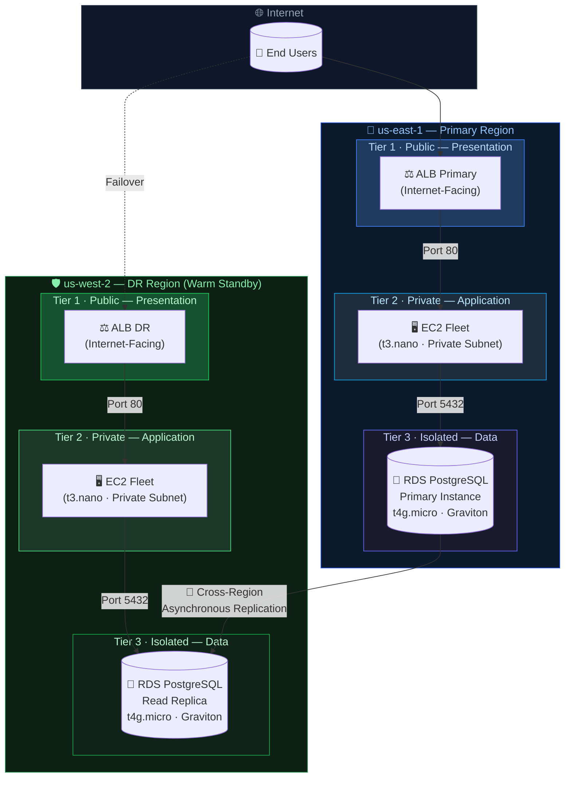
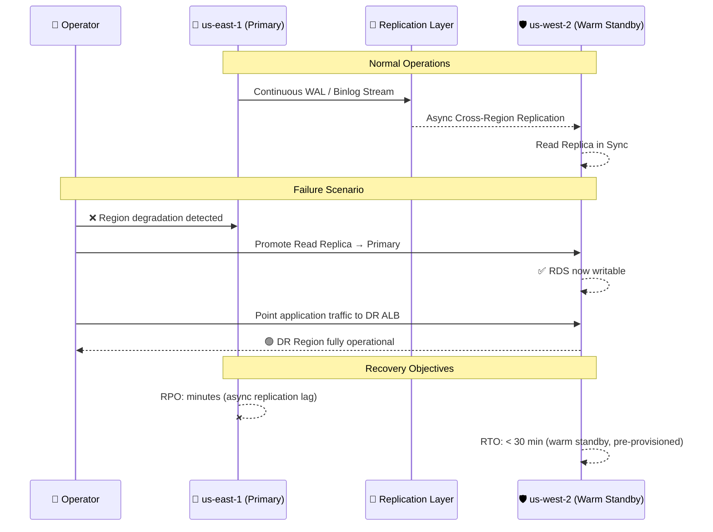
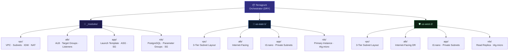
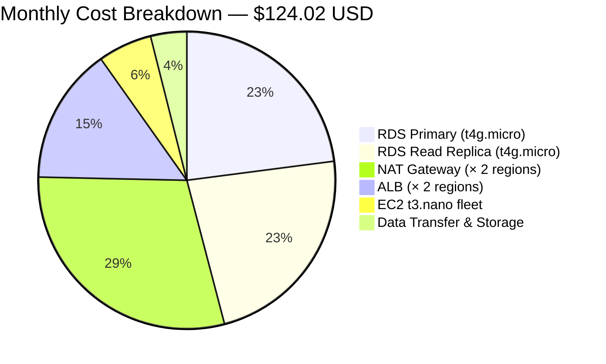

# FinNow — Multi-Region Resilient Infrastructure

<div align="center">


[](https://www.terraform.io/)
[](https://terragrunt.gruntwork.io/)
[](https://aws.amazon.com/)
[](https://www.infracost.io/)
[]()
[]()
[]()
[]()

<br/>

> **Production-grade, battle-tested IaC for a Fintech platform.**  
> Architected with **Defense-in-Depth security**, **3-Tier isolation**, and a **Warm-Standby DR strategy** spanning two AWS regions.

<br/>

[](http://finnow-alb-primary-140854010.us-east-1.elb.amazonaws.com)
[](http://finnow-alb-dr-1428542333.us-west-2.elb.amazonaws.com)

</div>

---

## 📐 Architecture Overview


---

## 🔒 Security Architecture — Defense in Depth

```mermaid
graph LR
    subgraph SG_ALB["🛡️ SG: alb-sg"]
        R1["Inbound: 0.0.0.0/0 → 80/tcp"]
        R2["Outbound: → App Tier SG"]
    end
    subgraph SG_APP["🛡️ SG: app-sg"]
        R3["Inbound: ALB SG → 80/tcp ONLY"]
        R4["Outbound: → Data Tier SG"]
        R5["Zero Public IP Enforced ✅"]
        R6["IMDSv2 Enforced ✅"]
    end
    subgraph SG_RDS["🛡️ SG: rds-sg"]
        R7["Inbound: App SG → 5432/tcp ONLY"]
        R8["No Internet Route ✅"]
    end

    SG_ALB --> SG_APP --> SG_RDS

    style SG_ALB fill:#1e1b4b,stroke:#6366f1,color:#c7d2fe
    style SG_APP fill:#1c2942,stroke:#3b82f6,color:#bfdbfe
    style SG_RDS fill:#1a1a2e,stroke:#818cf8,color:#e0e7ff
```


| Control | Implementation | Status |
|---|---|---|
| **Zero Public IP** | EC2 instances deployed in private subnets only | ✅ Enforced |
| **IMDSv2** | `http_tokens = required` on all launch templates | ✅ Enforced |
| **Least Privilege SGs** | Port-scoped rules, no `0.0.0.0/0` on compute/data tiers | ✅ Enforced |
| **Network Isolation** | 3 isolated subnets per AZ (public/private/data) | ✅ Enforced |
| **Encryption at Rest** | RDS storage encryption enabled | ✅ Enforced |
| **Cross-Region Replication** | Automated read replica with async replication | ✅ Active |

---

## 🌎 Disaster Recovery Strategy


| Metric | Target | Strategy |
|---|---|---|
| **RPO** (Recovery Point Objective) | Minutes | Async cross-region RDS replication |
| **RTO** (Recovery Time Objective) | < 30 min | Warm Standby — infrastructure pre-provisioned |
| **DR Activation** | Manual promotion | Promote read replica + redirect ALB DNS |
| **Data Consistency** | Eventually consistent | PostgreSQL asynchronous streaming replication |

---

## 🏗️ Infrastructure Components


---

## 📁 Repository Structure
```text
finnow-infrastructure/
│
├── terragrunt/
│   ├── _modules/                    # 🧩 Reusable Terraform base modules
│   │   ├── vpc/                     #    VPC, Subnets, IGW, NAT Gateway, Route Tables
│   │   ├── alb/                     #    Application Load Balancer, Target Groups
│   │   ├── app/                     #    EC2 Launch Template, ASG, Security Groups
│   │   └── rds/                     #    RDS PostgreSQL, Parameter Groups, Subnet Groups
│   │
│   ├── us-east-1/                   # 🏢 Primary Region — Virginia
│   │   ├── terragrunt.hcl           #    Region-level config & remote state
│   │   ├── vpc/terragrunt.hcl
│   │   ├── alb/terragrunt.hcl
│   │   ├── app/terragrunt.hcl
│   │   └── rds/terragrunt.hcl
│   │
│   └── us-west-2/                   # 🛡️ DR Region — Oregon
│       ├── terragrunt.hcl           #    Region-level config & remote state
│       ├── vpc/terragrunt.hcl
│       ├── alb/terragrunt.hcl
│       ├── app/terragrunt.hcl
│       └── rds/terragrunt.hcl       #    Cross-region replica source ARN injected
│
├── .infracost/                      # 💰 FinOps cost estimation config
├── screenshots/                     # 📸 Live deployment validation
└── README.md
```

---

## 💰 FinOps — Cost Analysis

> Estimated via **Infracost** based on `us-east-1` on-demand pricing.


| Resource | Type | Region | Est. Cost/mo |
|---|---|---|---|
| RDS PostgreSQL Primary | `db.t4g.micro` (Graviton) | `us-east-1` | ~$28.47 |
| RDS PostgreSQL Replica | `db.t4g.micro` (Graviton) | `us-west-2` | ~$28.47 |
| NAT Gateways | Managed NAT (× 2) | Both | ~$36.50 |
| Application Load Balancers | ALB (× 2) | Both | ~$18.40 |
| EC2 Application Fleet | `t3.nano` | Both | ~$7.30 |
| Storage, Transfer, Misc | — | — | ~$4.88 |
| **Total** | | | **~$124.02** |

> 💡 **FinOps Notes:** Graviton-based `t4g.micro` instances provide up to **40% cost savings** over equivalent x86 instance types with comparable or superior performance for PostgreSQL workloads.

---

## ⚙️ Deployment

### Prerequisites
```bash
# Required toolchain
terraform  >= 1.5.0
terragrunt >= 0.55.0
aws-cli    >= 2.x
infracost  >= 0.10.x  # optional — cost estimation
```

### Bootstrap
```bash
# 1. Configure AWS credentials for both regions
export AWS_PROFILE=finnow-prod

# 2. Deploy Primary Region first
cd terragrunt/us-east-1
terragrunt run-all apply

# 3. Deploy DR Region (depends on primary RDS ARN)
cd terragrunt/us-west-2
terragrunt run-all apply

# 4. Validate endpoints
curl -s http://finnow-alb-primary-140854010.us-east-1.elb.amazonaws.com/health
curl -s http://finnow-alb-dr-1428542333.us-west-2.elb.amazonaws.com/health
```

### Cost Estimation
```bash
# Estimate full infrastructure cost before apply
infracost breakdown --path terragrunt/ --terraform-parse-hcl
```

---

## 🔗 Live Endpoints

| Region | Role | Endpoint |
|---|---|---|
| `us-east-1` | 🟢 Primary | [finnow-alb-primary-140854010.us-east-1.elb.amazonaws.com](http://finnow-alb-primary-140854010.us-east-1.elb.amazonaws.com) |
| `us-west-2` | 🟡 Warm Standby | [finnow-alb-dr-1428542333.us-west-2.elb.amazonaws.com](http://finnow-alb-dr-1428542333.us-west-2.elb.amazonaws.com) |

---

## 🧱 Architecture Decision Records (ADR)

<details>
<summary><strong>ADR-001 · Terragrunt over pure Terraform</strong></summary>

**Context:** Multi-region deployments require managing remote state, provider configs, and cross-region dependencies without code duplication.  
**Decision:** Adopted Terragrunt as the orchestration layer to enforce DRY principles across region-specific deployments.  
**Consequences:** Reduces configuration drift, enforces consistent remote state backends, and enables `run-all` orchestration with dependency graphs.

</details>

<details>
<summary><strong>ADR-002 · Warm Standby over Active-Active or Cold Standby</strong></summary>

**Context:** Active-Active requires synchronous replication and significantly higher cost. Cold standby has unacceptable RTO for Fintech SLAs.  
**Decision:** Warm Standby with asynchronous cross-region RDS replication. Infrastructure is pre-provisioned; only manual DB promotion is required during failover.  
**Consequences:** RTO < 30min, minimal cost overhead, acceptable RPO for the current compliance requirements.

</details>

<details>
<summary><strong>ADR-003 · Graviton (t4g) for RDS workloads</strong></summary>

**Context:** PostgreSQL is CPU and memory-efficient; ARM-based Graviton processors offer better price/performance for this workload profile.  
**Decision:** Use `db.t4g.micro` (Graviton2) for all RDS instances.  
**Consequences:** ~40% cost reduction vs. equivalent Intel x86 instance. RDS fully supports Graviton for PostgreSQL 13+.

</details>

<details>
<summary><strong>ADR-004 · IMDSv2 enforcement</strong></summary>

**Context:** IMDSv1 is vulnerable to SSRF attacks that can expose IAM credentials via the metadata endpoint.  
**Decision:** Enforce `http_tokens = required` (IMDSv2) on all EC2 launch templates.  
**Consequences:** Eliminates SSRF-based credential exfiltration vector. Required by AWS Security Hub FSBP standard.

</details>

---

<div align="center">

**Built with precision by [gmt (Jose)](https://github.com/gmt)**

[](https://aws.amazon.com)
[](https://terraform.io)
[](https://terragrunt.gruntwork.io)

*"Infrastructure is not just code — it is the foundation of trust in financial systems."*

</div>
