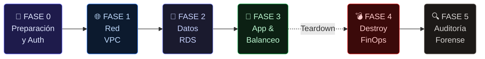
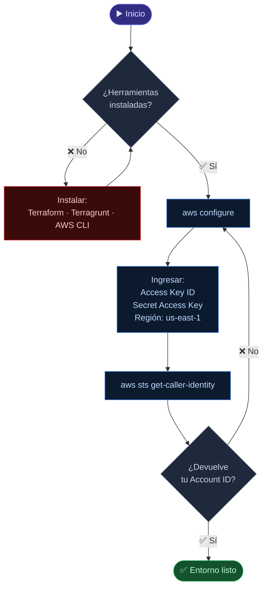
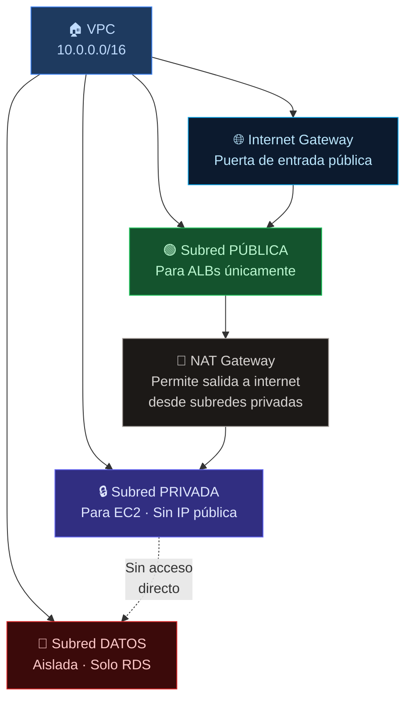
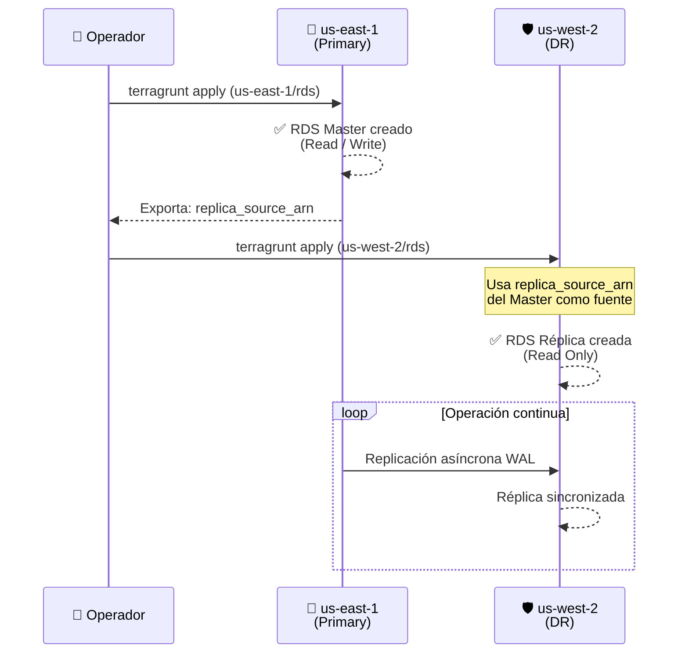
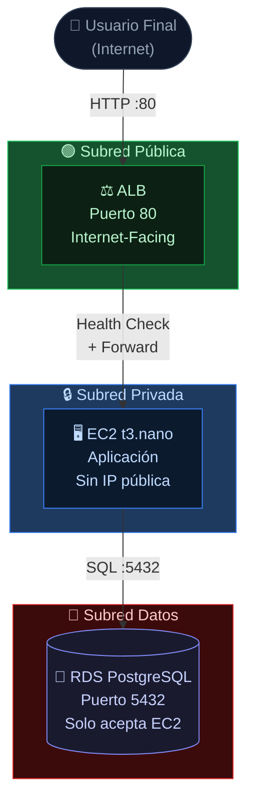
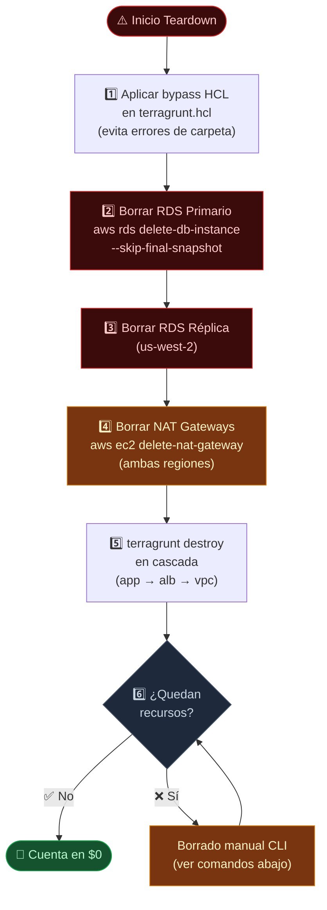
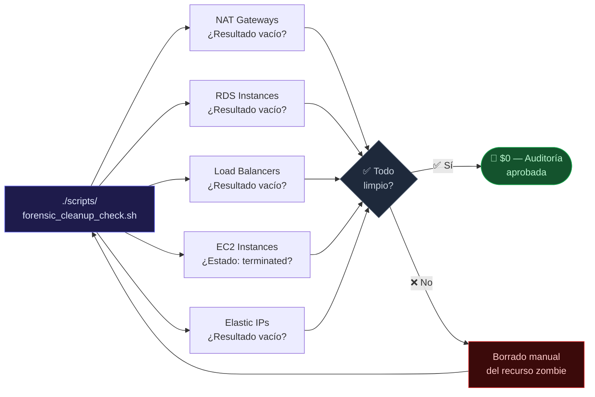

# 📘 FinNow DRX — Master Runbook

<div align="center">


[](https://www.terraform.io/)
[](https://terragrunt.gruntwork.io/)
[](https://aws.amazon.com/)
[]()
[]()

<br/>

> Guía definitiva de despliegue, operación y destrucción controlada de la infraestructura FinNow.  
> Diseñada para ser seguida **paso a paso**, incluso sin experiencia previa en AWS.

</div>

---

## 🗺️ Mapa General del Runbook


> **Regla de oro:** cada fase tiene una dependencia estricta de la anterior. No saltes pasos.

---

## 🔐 FASE 0 — Preparación y Autenticación

> *"Tu pasaporte para hablar con AWS. Sin esto, ningún comando funciona."*


### Checklist de Prerequisitos

| Herramienta | Versión Mínima | Verificar con |
|---|---|---|
| Terraform | `>= 1.5.0` | `terraform -version` |
| Terragrunt | `>= 0.55.0` | `terragrunt -version` |
| AWS CLI | `>= 2.x` | `aws --version` |
| Infracost | `>= 0.10.x` | `infracost --version` |
```bash
# Verificar identidad y permisos antes de cualquier despliegue
aws sts get-caller-identity
# Resultado esperado: Account ID, ARN y UserId — si falla, revisar credenciales
```

---

## 🌐 FASE 1 — Red (VPC · El Terreno)

> *"Construimos el terreno antes que la casa. Define el espacio lógico seguro donde vivirá toda la infraestructura."*

**Dependencias:** Ninguna. Es el primer paso de infraestructura.


### Despliegue
```bash
# Primero: Región Principal
cd terragrunt/us-east-1/vpc
terragrunt apply -auto-approve

# Segundo: Región DR (misma estructura, aislada)
cd terragrunt/us-west-2/vpc
terragrunt apply -auto-approve
```

### ✅ Validación
```bash
# Confirmar que la VPC y subredes existen en ambas regiones
aws ec2 describe-vpcs --region us-east-1 --query 'Vpcs[*].{ID:VpcId,CIDR:CidrBlock,State:State}'
aws ec2 describe-vpcs --region us-west-2 --query 'Vpcs[*].{ID:VpcId,CIDR:CidrBlock,State:State}'
```

---

## 🐘 FASE 2 — Datos (RDS · La Caja Fuerte)

> *"Los datos son el activo más crítico. El Master va primero, la Réplica después — nunca al revés."*

**Dependencias:** ✅ FASE 1 completa en **ambas** regiones.


### Despliegue
```bash
# ⚠️ CRÍTICO: El Master SIEMPRE primero
cd terragrunt/us-east-1/rds
terragrunt apply -auto-approve
# Esperar confirmación: aws_db_instance.this: Creation complete

# Solo después desplegar la Réplica
cd terragrunt/us-west-2/rds
terragrunt apply -auto-approve
```

### ✅ Validación
```bash
# Verificar estado de ambas instancias
aws rds describe-db-instances \
  --region us-east-1 \
  --query 'DBInstances[*].{ID:DBInstanceIdentifier,Status:DBInstanceStatus,Role:ReadReplicaSourceDBInstanceIdentifier}'

aws rds describe-db-instances \
  --region us-west-2 \
  --query 'DBInstances[*].{ID:DBInstanceIdentifier,Status:DBInstanceStatus}'
# Status esperado: "available" en ambas
```

---

## 🚀 FASE 3 — Aplicación & Balanceo (APP + ALB · La Tienda)

> *"Los servidores y el balanceador. Los usuarios nunca tocan la app directamente — el ALB es el único punto de contacto."*

**Dependencias:** ✅ FASE 1 (VPC) + ✅ FASE 2 (RDS) completas en ambas regiones.


### Despliegue
```bash
# Virginia — Primary
cd terragrunt/us-east-1/alb && terragrunt apply -auto-approve
cd terragrunt/us-east-1/app && terragrunt apply -auto-approve

# Oregon — DR (Warm Standby)
cd terragrunt/us-west-2/alb && terragrunt apply -auto-approve
cd terragrunt/us-west-2/app && terragrunt apply -auto-approve
```

### ✅ Validación de Endpoints
```bash
# Health check directo a ambos ALBs
curl -s http://finnow-alb-primary-140854010.us-east-1.elb.amazonaws.com/health
curl -s http://finnow-alb-dr-1428542333.us-west-2.elb.amazonaws.com/health
# Respuesta esperada: HTTP 200 OK
```

---

## 💣 FASE 4 — Destroy Controlado (FinOps · Nuke)

> *"Un recurso olvidado en AWS sigue cobrando. Esta fase es tan importante como el despliegue."*  
> **Filosofía FinOps:** destruir primero lo más caro (RDS → NAT → resto).


### Orden de Destrucción
```bash
# ── PASO 1: RDS Primario (lo más caro — $11.68/mo)
aws rds delete-db-instance \
  --db-instance-identifier finnow-rds-primary \
  --skip-final-snapshot \
  --region us-east-1

# ── PASO 2: RDS Réplica
aws rds delete-db-instance \
  --db-instance-identifier finnow-rds-replica \
  --skip-final-snapshot \
  --region us-west-2

# ── PASO 3: NAT Gateways (buscar IDs primero)
aws ec2 describe-nat-gateways --region us-east-1 \
  --query 'NatGateways[*].{ID:NatGatewayId,State:State}'
aws ec2 delete-nat-gateway --nat-gateway-id <ID> --region us-east-1
aws ec2 delete-nat-gateway --nat-gateway-id <ID> --region us-west-2

# ── PASO 4: Terragrunt destroy en cascada (orden inverso al despliegue)
cd terragrunt/us-east-1/app   && terragrunt destroy -auto-approve
cd terragrunt/us-east-1/alb   && terragrunt destroy -auto-approve
cd terragrunt/us-east-1/vpc   && terragrunt destroy -auto-approve
cd terragrunt/us-west-2/app   && terragrunt destroy -auto-approve
cd terragrunt/us-west-2/alb   && terragrunt destroy -auto-approve
cd terragrunt/us-west-2/vpc   && terragrunt destroy -auto-approve
```

---

## 🔍 FASE 5 — Auditoría Forense Final

> *"Los recursos 'zombie' son silenciosos y costosos. Esta auditoría garantiza que la cuenta llega a $0."*


### Comandos de Auditoría
```bash
# Ejecutar script completo
./scripts/forensic_cleanup_check.sh

# — O manualmente, recurso por recurso —

# NAT Gateways (resultado esperado: vacío o "deleted")
aws ec2 describe-nat-gateways \
  --filter Name=state,Values=available \
  --query 'NatGateways[*].NatGatewayId' \
  --region us-east-1
aws ec2 describe-nat-gateways \
  --filter Name=state,Values=available \
  --query 'NatGateways[*].NatGatewayId' \
  --region us-west-2

# RDS (resultado esperado: vacío)
aws rds describe-db-instances \
  --query 'DBInstances[*].DBInstanceIdentifier' \
  --region us-east-1
aws rds describe-db-instances \
  --query 'DBInstances[*].DBInstanceIdentifier' \
  --region us-west-2

# Load Balancers (resultado esperado: vacío)
aws elbv2 describe-load-balancers \
  --query 'LoadBalancers[*].LoadBalancerArn' \
  --region us-east-1
aws elbv2 describe-load-balancers \
  --query 'LoadBalancers[*].LoadBalancerArn' \
  --region us-west-2

# EC2 (resultado esperado: "terminated")
aws ec2 describe-instances \
  --query 'Reservations[*].Instances[*].{ID:InstanceId,State:State.Name}' \
  --region us-east-1
aws ec2 describe-instances \
  --query 'Reservations[*].Instances[*].{ID:InstanceId,State:State.Name}' \
  --region us-west-2

# Elastic IPs (resultado esperado: vacío)
aws ec2 describe-addresses --query 'Addresses[*].PublicIp' --region us-east-1
aws ec2 describe-addresses --query 'Addresses[*].PublicIp' --region us-west-2
```

### ✅ Checklist Final del Evaluador

| Recurso | Región | Resultado Esperado | Estado |
|---|---|---|---|
| NAT Gateways | `us-east-1` | `[]` vacío | `[ ]` |
| NAT Gateways | `us-west-2` | `[]` vacío | `[ ]` |
| RDS Instances | `us-east-1` | `[]` vacío | `[ ]` |
| RDS Instances | `us-west-2` | `[]` vacío | `[ ]` |
| Load Balancers | `us-east-1` | `[]` vacío | `[ ]` |
| Load Balancers | `us-west-2` | `[]` vacío | `[ ]` |
| EC2 Instances | `us-east-1` | `"terminated"` | `[ ]` |
| EC2 Instances | `us-west-2` | `"terminated"` | `[ ]` |
| Elastic IPs | `us-east-1` | `[]` vacío | `[ ]` |
| Elastic IPs | `us-west-2` | `[]` vacío | `[ ]` |

---

<div align="center">

**Built with precision by [gmt (Jose)](https://github.com/gmt)**

[](./README.md)
[](./INFRACOST.md)

*"Un buen runbook es el que puede seguir alguien a las 3am durante un incidente."*

</parameter>

</div>
